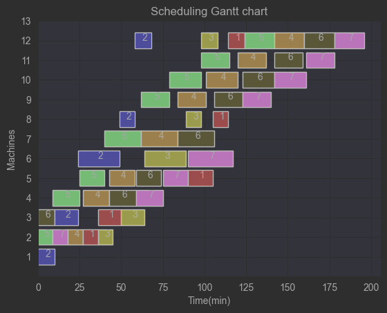
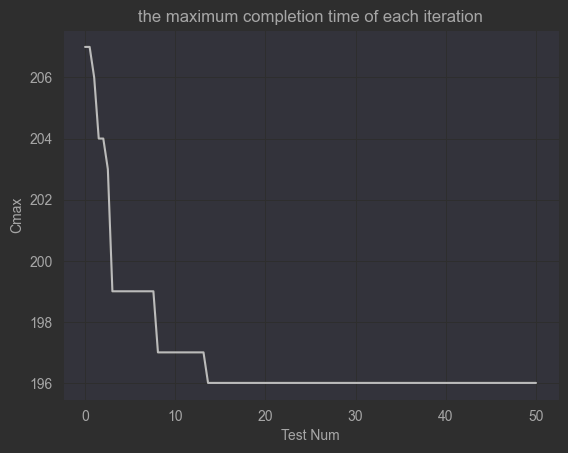

# Flexible Job-shop Scheduling Problem With Genetic Algorithm

This project involves using Genetic Algorithm to solve the dynamic scheduling problem of flexible Job Shop production.

## Prepare configuration file

* **Processing_time** : `the processing schedule of this production process`
    * The horizontal axis index represents the process sequence number, the vertical axis represents the processing
      machine sequence number, and the numerical value represents the corresponding processing time.
    * ''9999'' indicates that the corresponding machine cannot be selected in the process. 
    * For example:

      |  10   |   9   |   0    |   0    |   0    |   0    |   0    |   0   |   0    |   0    |   0    |   0    |
      |:-----:|:-----:|:------:|:------:|:------:|:------:|:------:|:-----:|:------:|:------:|:------:|:------:|
      | **0** | **0** | **14** | **16** | **0**  | **0**  | **0**  | **0** | **0**  | **0**  | **0**  | **0**  |
      | **0** | **0** | **0**  | **0**  | **15** | **25** | **21** | **0** | **0**  | **0**  | **0**  | **0**  |
      | **0** | **0** | **0**  | **0**  | **0**  | **0**  | **0**  | **9** | **13** | **25** | **24** | **0**  |
      | **0** | **0** | **0**  | **0**  | **0**  | **0**  | **0**  | **0** | **0**  | **0**  | **0**  | **10** |

      ```python

      Processing_time = [[10, 9, 9999, 9999, 9999, 9999, 9999, 9999, 9999, 9999, 9999, 9999],
                         [9999, 9999, 14, 16, 9999, 9999, 9999, 9999, 9999, 9999, 9999, 9999],
                         [9999, 9999, 9999, 9999, 15, 25, 21, 9999, 9999, 9999, 9999, 9999],
                         [9999, 9999, 9999, 9999, 9999, 9999, 9999, 9, 13, 15, 24, 9999],
                         [9999, 9999, 9999, 9999, 9999, 9999, 9999, 9999, 9999, 9999, 9999, 10]]
      ```

* **J** : `workpiece number and corresponding operation number of each workpiece`

* **M_num** :  `number of machines`

* **O_num** :  `number of operations for all workpieces`

* **J_num** :  `number of workpieces`

## Set parameters of genetic algorithm

* Set in the construction method of the **GA** class

```python
class GA():
    def __init__(self):
        self.Pop_size = 400
        self.Pc = 0.8
        self.Pm = 0.3
        self.Pv = 0.5
        self.Pw = 0.95
        self.Max_Itertions = 100
```

## Display of the results

* processing schedule showed in gantt chart



* the maximum completion time of each iteration


