# 基于遗传算法的柔性车间生产调度问题

本项目主要涉及使用遗传算法解决柔性车间生产调度问题。

## 1. 根据实际问题创建 Instance.py

例如，以下是每一工件的生产加工时间表。

|      | 机器1 | 机器2 | 机器3 | 机器4 | 机器5 | 机器6 | 机器7 | 机器8 | 机器9 | 机器10 | 机器11 |
| :---: | :---: | :---: | :---: | :---: | :---: | :---: | :---: | :---: | :---: | :----: | :----: |
| 工序1 |  10  |   0   |   0   |   0   |   0   |   0   |   0   |   0   |   0   |   0   |   0   |
| 工序2 |   0   |   9   |   0   |   0   |   0   |   0   |   0   |   0   |   0   |   0   |   0   |
| 工序3 |   0   |   0   |  14  |  16  |   0   |   0   |   0   |   0   |   0   |   0   |   0   |
| 工序4 |   0   |   0   |   0   |   0   |  15  |  25  |  21  |   0   |   0   |   0   |   0   |
| 工序5 |   0   |   0   |   0   |   0   |   0   |   0   |   0   |   9   |  13  |   25   |   14   |

假设某一车间共生产 **5** 个上述的工件，对应的 **Instance.py** 应该写成下面的格式。

```python
Processing_time = [[10, 9999, 9999, 9999, 9999, 9999, 9999, 9999, 9999, 9999, 9999],
                   [9999, 9, 9999, 9999, 9999, 9999, 9999, 9999, 9999, 9999, 9999],
                   [9999, 9999, 14, 16, 9999, 9999, 9999, 9999, 9999, 9999, 9999],
                   [9999, 9999, 9999, 9999, 15, 25, 21, 9999, 9999, 9999, 9999],
                   [9999, 9999, 9999, 9999, 9999, 9999, 9999, 9, 13, 25, 24]]
J = {1: 5, 2: 5, 3: 5, 4: 5, 5: 5}
J_num = 5
M_num = 11
O_num = 25
```

各参数的具体含义如下：

* **Processing_time** : `每一个工件的加工时间列表`
  * _在加工时间表中，行索引代表的是各工序的序号，列索引代表的是各加工机器的序号，表中的数值代表的是工件的每一工序对应选择加工机器的加工时间。_
  * _如果在某一工序中不能使用该机器加工，对应的加工时间应该在列表中用 **9999** 替代。_
* **J** : `以字典的格式表示的加工信息，其中字典的键表示工件的序号，对应键的值表示加工该工件共需多少工序`
* **J_num** : `工件的数量`
* **M_num** : `机器的数量`
* **O_num** : `所有工件的工序总数量`

## 2. 设置遗传算法的参数

在 **GA.py** 中设置遗传算法的参数。

```python
class GA():
    def __init__(self):
        self.Pop_size = 400
        self.Pc = 0.8
        self.Pm = 0.3
        self.Pv = 0.5
        self.Pw = 0.95
        self.Max_Itertions = 100
```

各参数的具体含义如下：

* **Pop_size** : `种群数量`
* **Pc** : `进行交叉运算的概率`
* **Pm** : `进行变异运算的概率`
* **Pv** : `以何种方式进行交叉运算的概率`
* **Pw** : `以何种方式进行变异运算的概率`
* **Max_Itertions** : `种群最大的进化代数`

## 3. 运行 main.py

在运行 **main.py** 后，会产生以下两个结果。

* **结果1** : 用甘特图绘制的所用工件各工序的加工时间表

  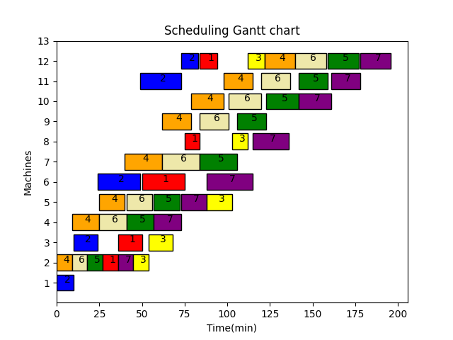

* **结果2** : 每次种群进化后生产所有工件的最大完成时间

  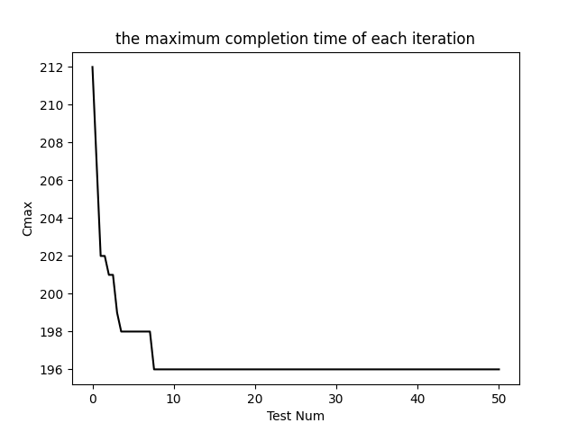

## 4. 编程思路

### （1）问题描述

* 柔性车间调度问题描述如下：

  * $n$ 个工件 $(J_1,J_2,J_3,...,J_n)$ 要在 $m$ 台机器 $(M_1,M_2,...,M_m)$ 上加工；每个工件包含一道或多道工序；工序顺序是预先确定的；每道工序可以在多台不同加工机器上进行加工；工序的加工时间随加工机器的不同而不同；调度目标是为每到工序选择最合适的机器，确定每台机器上各道工序最佳加工顺序及开工时间，使整个系统的某些性能指标达到最优。
  
  * 假设按照表2-2的加工时间表设计。

  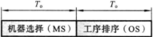

* 遗传算法的计算流程：假设P表示种群规模，t表示当前代，P(t)和C(t)表示第t代的父代和子代，那么基本的遗传算法执行步骤如下。

  * 按照一定的初始化方法产生初始种群P(t)，t=0。
  * 评价种群P(t)，计算每个个体的适应度值。
  * 判断是否满足终止条件，如果满足则输出结果；否则转下一步骤。
  * 按照选择、交叉、变异等遗传算子产生子代C(t)。
  * P(t) = C(t)，转步骤2，t=t+1。

  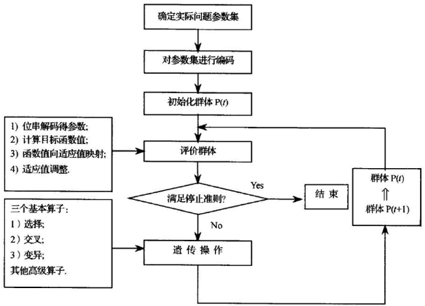

### （2）编码

* 染色体编码是将所研究的问题的解用染色体的形式来表达的，这是遗传算法的关键。编码的目的是为了实现交叉、变异等类似于生物界的遗传操作。必须考虑染色体的合法性、可行性、有效性，以及对问题解空间表达的完全性。良好的编码方式可以在后续遗传操作中易产生可行解，提高执行效率；否则，经过遗传操作会产生不可行解，需要一定的修补措施，这样就降低了执行效率。染色体编码对求解速度、计算精度等有着直接的关系，对算法具有重要影响。

* FJSP包括两个子问题：机器选择和工序排序。机器选择解决每道工序在可选机器集中的哪台机器上进行加工的问题；工序排序解决所有工序确定加工机器后的排序和开工时间问题。针对编码过程中对两个子问题编码处理的不同，目前主要有以下两种不同的编码方法

* 针对编码过程中两个问题编码处理的不同，目前主要有以下两种不同的编码方法。

  * **集成编码**：集成编码染色体中的每一个基因位 $(h,j,i)$ 代表一个工序任务，表示工件 $j$ 的第 $h$ 道工序在机器 $i$ 上加工，染色体总长度等于所有工件的工序总和 $T_o$ 。
  * **分段编码**：分段编码染色体有A/B两部分组成，将工序信息分开处理，分别表示FJSP的两个子问题，两部分染色体长度都等于 $T_o$ 。

* 此处设计了一种整数编码MSOS，由两部分组成：机器选择部分（machines selection,MS）和工序排序部分（operations sequencing,OS）。

  * **机器选择部分**：机器选择部分染色体长度为 $T_o$ 。每个基因位用整数表示，依次按照工件和工件工序的顺序进行排列，每个整数表示当前工序选择的加工机器在可选机器集中的顺序编号，并不是对应的机器号，这保证了后续交叉、变异等操作后产生的解仍然是可行解。如下图所示，依次是工件 $J_1$ 和工件 $J_2$ 的所有工序。工序 $O_{11}$ 有5台机器可以选择，对应的4表示可选机器集中第4台机器，即在机器 $M_4$ 上进行加工。同理，工序 $O_{12}$ 有2台机器可以选择，分别为机器 $M_2$ 和机器 $M_4$ ，图中对应的“1”表示可选机器集中的第1台机器，即在机器 $M_2$ 上进行加工。
  * **工序选择部分**：此部分采用基于工序的编码方式进行编码，染色体长度等于所有工件的工序之和 $T_o$ 。每一个基因用工件号直接编码，工件号出现的顺序表示该工件工序间的先后加工顺序，即对染色体从左到右进行编译，对于第h次出现的工件号，表示该工件 $j$ 的第 $h$ 道工序，并且工件号的出现次数等于该工件的工序总数 $h_j$ 。如下图所示，假设工序染色体为 [2 2 1 1 2] ，则其中第一个“2”表示工件 $J_2$ 的工序 $O_{21}$ ，第二个“2”表示工件 $J_2$ 的工序 $O_{22}$ ，以此类推，转换成各工件工序的加工顺序为 $O_{21}$ → $O_{22}$ → $O_{11}$ → $O_{12}$ → $O_{23}$ 。

    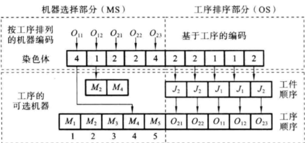

### （3）解码

* FJSP染色体MSOS由两部分组成，分别对它们进行解码，关键是需要将工序排序部分解码成对应于机器选择部分的活动调度，具体的解码步骤如下。

  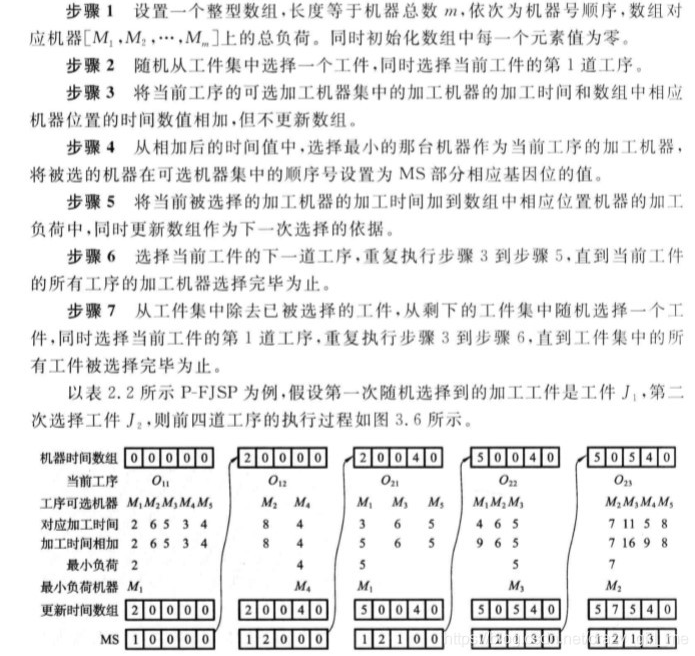
  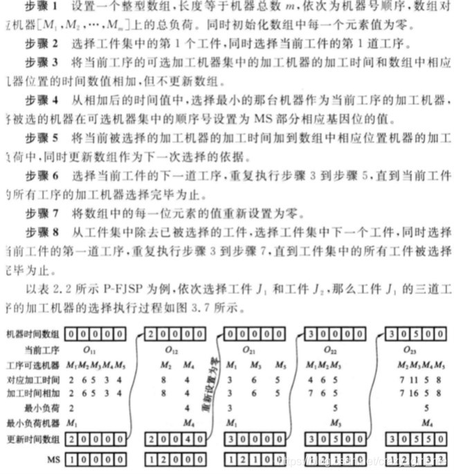

### （4）初始化

* 种群初始化在进化算法中是一个关键问题，初始解的质量对遗传算法求解的速度和质量有非常大的影响。FJSP不但要解决机器选择问题，还要解决所有工序排序问题。目前，大部分文献一般采用的是随机初始化方法，使得初始解的质量偏低，机器之间负荷不均衡，导致要增加迭代次数或种群大小来达到最优解或近似最优解，这势必增加优化时间。

* 针对FJSP特点，此处提出一种GLR机器选择方法，包括：全局选择（Global Selection）、局部选择（Local Selection）和随机选择（Random Selection）。GS和LS主要是为了考虑机器选择的负荷问题，使各台被选择的机器的工作负荷尽量平衡，充分提高机器的利用率。RS主要考虑尽量使初始种群分散地分布于整个解空间。通过三者的有机结合，提高初始解在机器选择部分中解的质量。下面分别介绍三种选择方法的具体执行步骤

* **全局选择**：设置一个数组，长度和机器数相等，数组的顺序依次对应加工机器的顺序，每一位上的值对应相应机器上的加工时间。随机在工件集中选择一个工件，从当前工件的第1道工序开始，将当前工序的可选加工机器的加工时间加上数组中对应的时间。从中选择最短的时间作为当前工序的加工机器，并且将数组更新，即把被选择的加工机器的加工时间加到数组中相应的位置上，以此类推，直到当前工件的所有工序的加工机器选择完毕后，然后再随机选择一个工件开始，直到所有工件的工序选择完毕为止。这样保证了最短加工机器先被选到而且保证了加工机器上的工作负荷平衡。具体执行步骤如下。

  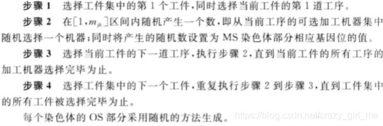

* **局部选择**：局部选择同全局选择原理上基本一致，但是每次对一个工件选择完毕时，数组需要重新设置为零，不存在随机选择工件。设置一个数组，长度和机器数相等，选择工件集中第1个工件，选择当前工件的第1道工序开始，将当前工序的可选加工机器的加工时间加上数组中对应的时间。从中选择最短的时间作为当前工序的加工机器，并且将数组更新，即把被选择的加工机器的加工时间加到数组中相应的位置上，以此类推，直到当前工件的所有工序的加工机器选择完毕后，然后数组每一位重新设置为零，选择下一个工件，直到所有工件选择完毕为止。这样保证了一个工件的工序中优先加工时间最短或说选择机器负荷最小的加工机器进行加工。具体执行步骤如下。

  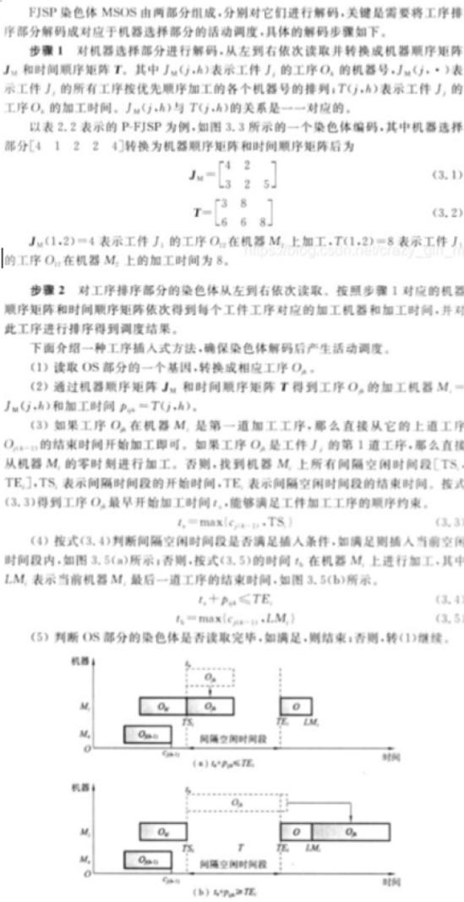

* **随机选择**：为保证初始种群的多样性，初始种群应分散于解空间。一部分种群的机器选择部分采用随机初始化方法。RS与GS、LS的主要区别在于每一个基因位上的数字即表示工序可选机器集中的顺序号是随机产生的。具体执行步骤如下。

  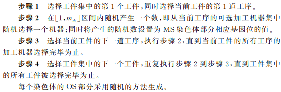

### （5）交叉操作

* 交叉的目的是利用父代个体经过一定操作组合后产生新个体，在尽量降低有效模式被破坏的概率基础上对解空间进行高效搜索。交叉操作是主要的遗传操作，GA的性能在很大程度上依赖于所使用的交叉操作，它决定了GA的全局搜索能力。在设计交叉操作时必须满足可行性、特征的有效继承性、完全性和信息非冗余性等指标。特征的有效继承性保证父代中的优良信息能够保留到子代；信息非冗余性保证子代中不会产生过多无用信息，这两个特征在交叉操作设计中是两个重要的指标。

* **机器选择部分**：机器选择部分必须保证每位基因的先后顺序保持不变，采用均匀交叉操作。

  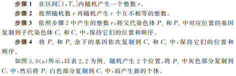

* **工序排序部分**：每个染色体中对多个工件进行操作，能够较好地继承父代个体的优良特征。

  

  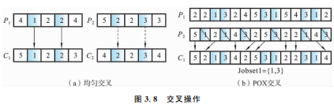

### （6）变异操作

* 变异操作通过随机改变染色体的某些基因对染色体进行较小扰动来生成新的个体，增加种群多样性，并在一定程度上影响着GA的局部搜索能力。此处结合FJSP特点，设计变异方法如下。

  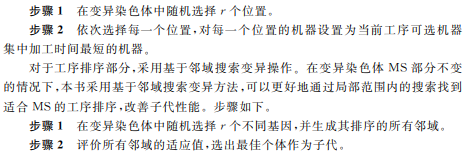

### （7）选择操作

* 选择操作的作用是使高性能的个体能以更高的概率生存，避免有效基因的损失，同时保持种群大小恒定，从而加快全局收敛性和提高计算效率。
